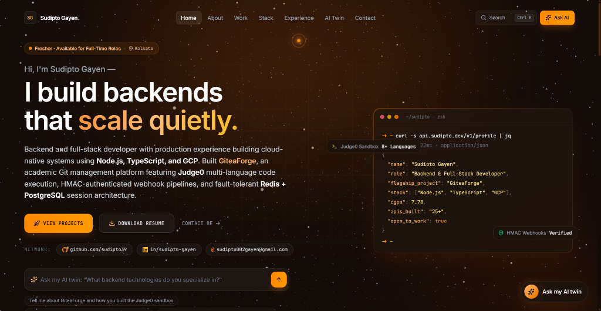

# Sudipto Gayen — Software Engineer & Cloud-Native Portfolio

> **Production Backend & Full-Stack Developer** · Cloud-Native Distributed Systems, Zero-Drift Architectures & Cryptographic Security.

<p align="center">
  
</p>

A high-performance, dark-ember themed engineering portfolio built with React 19, TypeScript, Vite, Tailwind CSS, and Framer Motion. Featuring an interactive 3D technology constellation orbit, AI twin assistant studio with token-by-token SSE streaming, live SVG system topology visualizers, and comprehensive architecture case studies.

---

## 🌟 Highlights

- **Interactive 3D Stack Orbit**: Custom spherical projection rendered in 60fps canvas with interactive node inspection, proficiency indicators, and production stack cross-referencing.
- **Embedded AI Twin Studio**: Interactive conversational twin powered by Google Gemini, Groq, or verified offline demo engine with streaming token updates, contextual system grounding, and zero-setup fallback.
- **Interactive Cloud-Native Topologies**: Live animated SVG architecture diagrams illustrating GCP Cloud Run, Express 5 gateways, HMAC-SHA256 webhook validation, Neon PostgreSQL, and Judge0 sandboxes.
- **Micro-choreographed UX**: Fluid page transitions, relaxed deceleration entrance curves (`[0.16, 1, 0.3, 1]`), directional 3-card lateral choreography, and custom ember-themed scrollbars.
- **Zero Drift Architecture**: Built with Vite and TypeScript for sub-second hot reloading and single-file standalone distribution.

---

## 🛠️ Tech Stack

- **Core**: React 19, TypeScript 5.8, Vite 7
- **Styling**: Tailwind CSS v4, Lucide React icons
- **Motion & Physics**: Framer Motion
- **AI Integrations**: Server-Sent Events (SSE) streaming engine with Google Gemini, Groq, and local demo providers
- **Deployment**: Static SPA / GCP Cloud Run / Vercel / GitHub Pages

---

## 🚀 Getting Started

### Prerequisites

- Node.js (v18 or higher)
- npm or pnpm / yarn

### Installation

```bash
# Clone the repository
git clone https://github.com/sudipto39/portfolio.git

# Enter the project directory
cd portfolio

# Install dependencies
npm install
```

### Development

```bash
# Start local development server
npm run dev
```

Visit `http://localhost:5173` (or the port displayed in your terminal) to explore the portfolio.

### Production Build

```bash
# Build optimized production bundle
npm run build

# Preview production build locally
npm run preview
```

---

## 📂 Project Structure

```text
portfolio/
├── public/                 # Static assets & favicon
├── src/
│   ├── components/         # UI components, layout, shared widgets & diagrams
│   │   ├── ai/             # AI Twin chat panel, message threads & settings
│   │   ├── animations/     # Floating embers, canvas page backgrounds & paragraph reveals
│   │   ├── layout/         # Header navigation bar, footer & command palette
│   │   ├── sections/       # Hero terminal, tech marquee & 3D stack orbit
│   │   ├── ui/             # Accessible buttons, inputs, dialogs & spotlight cards
│   │   ├── ArchitectureDiagram.tsx
│   │   ├── SystemTopologyDiagram.tsx
│   │   └── shared.tsx
│   ├── data/               # Profile schema, project deep-dives & competency taxonomy
│   │   ├── profile.ts      # Single source of truth for resume details & milestones
│   │   └── stack.ts        # Core & orbital tech stack categorization
│   ├── hooks/              # Custom hooks (AI chat engine, theme, keyboard shortcuts)
│   ├── lib/                # AI provider configuration & system prompt generation
│   ├── pages/              # Routed pages (Home, About, Projects, Stack, Experience, AI Twin, Contact)
│   └── utils/              # Class merge utility (cn) & helpers
├── .gitignore
├── index.html
├── package.json
├── tsconfig.json
└── vite.config.ts
```

---

## 👤 Author

**Sudipto Gayen**
- **GitHub**: [@sudipto39](https://github.com/sudipto39)
- **LinkedIn**: [linkedin.com/in/sudipto-gayen](https://www.linkedin.com/in/sudipto-gayen-89a3a1290/)
- **Email**: [sudiptogayen404@gmail.com](mailto:sudiptogayen404@gmail.com)

---

## 📄 License

This project is open-source under the [MIT License](LICENSE).
